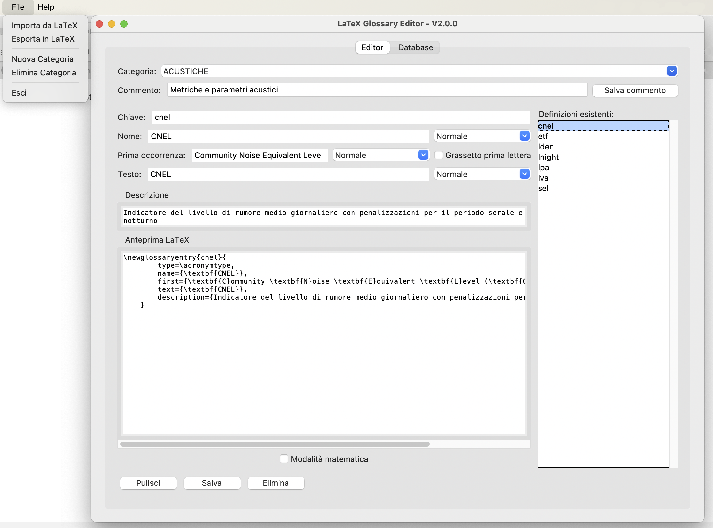
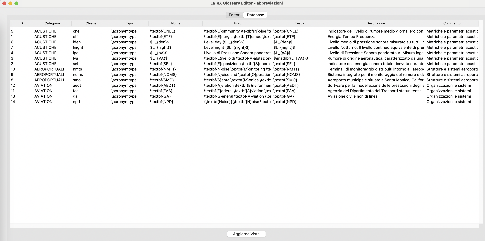

# LaTeX Glossary Editor - V2.0.0


### Supported Operating Systems


### Technologies


## 📖 Indice

- [Descrizione](#-descrizione)
- [Caratteristiche](#-caratteristiche)
- [Requisiti di Sistema](#-requisiti-di-sistema)
- [Installazione](#-installazione)
- [Guida all'Uso](#-guida-alluso)
- [Struttura del Progetto](#-struttura-del-progetto)
- [Funzionalità Avanzate](#-funzionalità-avanzate)
- [Risoluzione Problemi](#-risoluzione-problemi)
- [Contribuire](#-contribuire)
- [Roadmap](#-roadmap)
- [Licenza](#-licenza)
- [Contatti](#-contatti)


📝 Descrizione

LaTeX Glossary Editor è un'applicazione desktop cross-platform (MacOS, Windows, Linux) progettata per semplificare la gestione dei glossari nei documenti LaTeX. Offre un'interfaccia grafica intuitiva che permette agli utenti di creare, modificare e organizzare definizioni e abbreviazioni in modo efficiente, eliminando la complessità della gestione manuale del codice LaTeX.

### Perché LaTeX Glossary Editor?

- **Semplificazione del Workflow**: Elimina la necessità di scrivere manualmente il codice LaTeX per le definizioni del glossario
- **Gestione Centralizzata**: Organizza tutte le definizioni in un database strutturato
- **Compatibilità Cross-Platform**: Funziona perfettamente su Windows e macOS
- **Supporto Completo LaTeX**: Gestisce correttamente la formattazione matematica e i comandi LaTeX

## 🎯 Caratteristiche

### Funzionalità Core

- **Gestione Progetti**
  - Creazione e gestione di progetti multipli
  - Importazione/esportazione da/verso file LaTeX
  - Backup automatico dei dati

### Interfaccia Utente

- **Editor Visuale**
  - Campi dedicati per ogni componente della definizione
  - Formattazione del testo in tempo reale
  - Anteprima LaTeX istantanea

- **Organizzazione**
  - Categorizzazione delle definizioni
  - Sistema di ricerca e filtri
  - Vista database integrata

### Formattazione

- **Supporto Completo LaTeX**
  - Modalità matematica integrata
  - Comandi di formattazione (\textbf, \mathbf, \textit, ecc.)
  - Gestione automatica delle graffe e degli escape

### Gestione Dati

- **Database SQLite**
  - Salvataggio automatico
  - Gestione efficiente delle relazioni
  - Backup integrato

## 📸 Screenshots


*Interfaccia principale dell'editor*


*Vista del database delle definizioni*

### Dipendenze Python

```plaintext
tkinter
sqlite3
re
pathlib
```

### Installazione Standard

1. **Clonazione Repository**

   ```bash
   git clone https://github.com/AntonioDEM/LaTeX-Glossary-Editor.git
   cd LaTeX-Glossary-Editor
   ```

2. **Creazione Ambiente Virtuale (Opzionale ma Raccomandato)**

   ```bash
   python -m venv venv
   source venv/bin/activate  # Linux/macOS
   venv\Scripts\activate     # Windows
   ```

3. **Installazione Dipendenze**

   ```bash
   pip install -r requirements.txt
   ```

4. **Avvio Applicazione**

   ```bash
   python glossary_editor.py
   ```

## 📚 Guida all'Uso

### Primi Passi

1. **Creazione Nuovo Progetto**
   - Apri l'applicazione
   - Seleziona "File > Nuovo Progetto"
   - Inserisci nome e descrizione

2. **Gestione Categorie**
   - Crea nuove categorie da "File > Nuova Categoria"
   - Aggiungi commenti per organizzare meglio le definizioni

3. **Inserimento Definizioni**
   - Seleziona una categoria
   - Compila i campi richiesti:
     - Chiave (identificatore univoco)
     - Nome (con opzioni di formattazione)
     - Prima occorrenza
     - Testo
     - Descrizione

4. **Formattazione**
   - Usa i controlli di formattazione per:
     - Testo in grassetto
     - Testo in corsivo
     - Modalità matematica
     - Prima lettera in grassetto

### Funzionalità Avanzate

- **Importazione LaTeX**
  - Supporto per file esistenti
  - Parsing automatico delle definizioni
  - Mantenimento della formattazione

- **Esportazione**
  - Generazione codice LaTeX
  - Esportazione selettiva per categoria
  - Backup del database

## 📁 Struttura del Progetto

```plaintext
LaTeX-Glossary-Editor/
├── abt/                  # Componenti dell'interfaccia About
│   ├── about_window.py   # Finestra informazioni
│   └── info.py          # Configurazioni applicazione
├── assets/              # Risorse statiche
│   ├── icons/          # Icone dell'interfaccia
│   └── images/         # Immagini dell'applicazione
├── src/                 # Codice sorgente principale
│   ├── db_manager.py    # Gestione database SQLite
│   ├── glossary_db.py   # Logica del glossario
│   ├── glossary_os_handler.py  # Gestione multipiattaforma
│   ├── latex_parser.py  # Parser per file LaTeX
│   ├── options_write.py # Gestione opzioni di scrittura
│   └── project_manager.py # Gestione progetti
├── tests/              # Suite di test
├── docs/               # Documentazione
├── LICENSE             # Licenza MIT
├── README.md          # Questo file
├── requirements.txt   # Dipendenze Python
└── glossary_editor.py # Entry point applicazione
```

## 🛠️ Funzionalità Avanzate

### Sistema di Template

- Template predefiniti per definizioni comuni
- Personalizzazione dei template
- Importazione/esportazione template

### Backup e Sincronizzazione

- Backup automatico del database
- Esportazione in formato JSON/XML
- Sincronizzazione tra dispositivi

### Personalizzazione

- Temi interfaccia
- Scorciatoie da tastiera personalizzabili
- Configurazione formattazione predefinita

## ❗ Risoluzione Problemi

### Problemi Comuni

1. **Database non accessibile**
   - Verifica i permessi della directory
   - Controlla il path del database
   - Riavvia l'applicazione

2. **Errori di Importazione LaTeX**
   - Verifica la sintassi del file
   - Controlla la codifica del file (UTF-8)
   - Usa l'opzione di debug per maggiori dettagli

3. **Problemi di Formattazione**
   - Pulisci la cache dell'applicazione
   - Verifica la sintassi LaTeX
   - Usa l'anteprima per controllare il risultato

## 🤝 Contribuire

### Come Contribuire

1. Fai un fork del repository
2. Crea un branch per la feature (`git checkout -b feature/NuovaFeature`)
3. Committa le modifiche (`git commit -m 'Aggiunta nuova feature'`)
4. Pusha il branch (`git push origin feature/NuovaFeature`)
5. Apri una Pull Request

### Linee Guida

- Segui le convenzioni di codice Python (PEP 8)
- Aggiungi test per le nuove funzionalità
- Aggiorna la documentazione
- Mantieni i commit atomici e descrittivi

## 🗺️ Roadmap

### Prossime Feature

- [ ] Supporto per più lingue
- [ ] Editor LaTeX integrato
- [ ] Sincronizzazione cloud
- [ ] Modalità collaborativa
- [ ] Integrazione con sistemi CI/CD

## 📄 Licenza

Questo progetto è rilasciato sotto licenza MIT. Vedi il file [LICENSE](LICENSE) per i dettagli.

## 📞 Contatti

- **Sviluppatore**: Antonio Demarcus
- **GitHub**: [@AntonioDEM](https://github.com/AntonioDEM)
- **Email**: [antonio.demarcus@example.com](mailto:antonio.demarcus@example.com)
- **LinkedIn**: [Antonio Demarcus](https://linkedin.com/in/antonio-demarcus)
