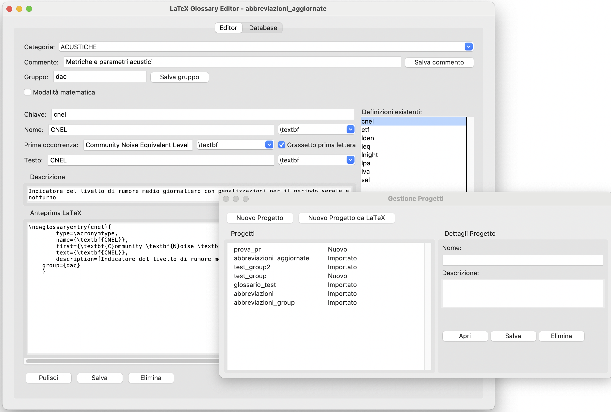
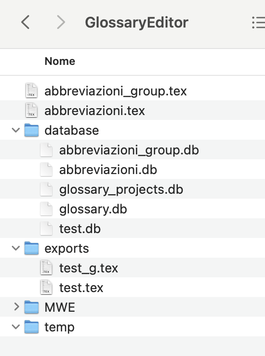

# LaTeX Glossary Editor - V2.


### Supported Operating Systems


### Technologies


Un editor grafico Corss-Platform (MacOSX, Windows, Linux) per la gestione di glossari LaTeX che semplifica la creazione e la manutenzione di definizioni e abbreviazioni in documenti tecnici e scientifici.

## 🎯 Caratteristiche Principali

- Interfaccia grafica intuitiva per la gestione delle definizioni
- Supporto per formattazione matematica LaTeX
- Organizzazione delle definizioni per categorie
- Anteprima in tempo reale del codice LaTeX generato
- Importazione ed esportazione di definizioni da/verso file LaTeX
- Gestione delle formattazioni (\textbf, \mathbf, ecc.)
- Cross-platform: funziona su Windows, macOS e Linux

## 📸 Screenshots


*Interfaccia principale dell'editor*


*Vista del database delle definizioni*

## 🚀 Installazione

1. Clona il repository:
```bash
git clone https://github.com/AntonioDEM/LaTeX-Glossary-Editor.git
```

2. Installa le dipendenze:
```bash
pip install tkinter sqlite3
```

3. Esegui l'applicazione:
```bash
python glossary_editor.py
```

## 💡 Utilizzo

Al primo avvio crea una cartella GlossaryEditor 



Si possono creare delle nuove categorie e le rispettive definizioni oppure importare un file esistente come ad esempio 

abbreviazioni.tex per il quale verrà creato un data base popolato

1. Crea una nuova categoria o selezionane una esistente
2. Inserisci i dettagli della definizione:
   - Chiave univoca
   - Nome (con supporto per formattazione)
   - Prima occorrenza
   - Testo
   - Descrizione
3. Usa i controlli di formattazione per applicare stili (normale, grassetto, corsivo)
4. Visualizza l'anteprima LaTeX in tempo reale
5. Salva la definizione nel database
6. Esporta tutte le definizioni in un file LaTeX

## 📁 Struttura del Progetto

```
LaTeX-Glossary-Editor/
├── abt/
│   ├── about_window.py    # Finestra delle informazioni
│   └── info.py           # Configurazioni dell'app
├── assets/               # Risorse (logo, immagini)
├── src/
│   ├── db_manager.py     # Gestione database
│   ├── glossary_db.py    # Logica del glossario
│   ├── glossary_os_handler.py  # Gestione cross-platform
│   ├── latex_parser.py   # Parser LaTeX
│   └── options_write.py  # Gestione opzioni
├── LICENSE               # Licenza MIT
├── glossary_editor.py    # Entry point
└── readme.md            # Documentazione
```

## 🤝 Contributi

Contributi e suggerimenti sono sempre benvenuti! Per contribuire:

1. Fai un fork del repository
2. Crea un nuovo branch (`git checkout -b feature/nuova-feature`)
3. Committa le tue modifiche (`git commit -am 'Aggiunta nuova feature'`)
4. Pusha il branch (`git push origin feature/nuova-feature`)
5. Apri una Pull Request

## 👥 Autori

- Antonio Demarcus ([@AntonioDEM](https://github.com/AntonioDEM)) - Sviluppatore Principale
- Claude ([@Anthropic](https://www.anthropic.com)) - Contributi allo sviluppo

## 📄 Licenza

Questo progetto è rilasciato sotto licenza MIT - vedi il file [LICENSE](LICENSE) per i dettagli.